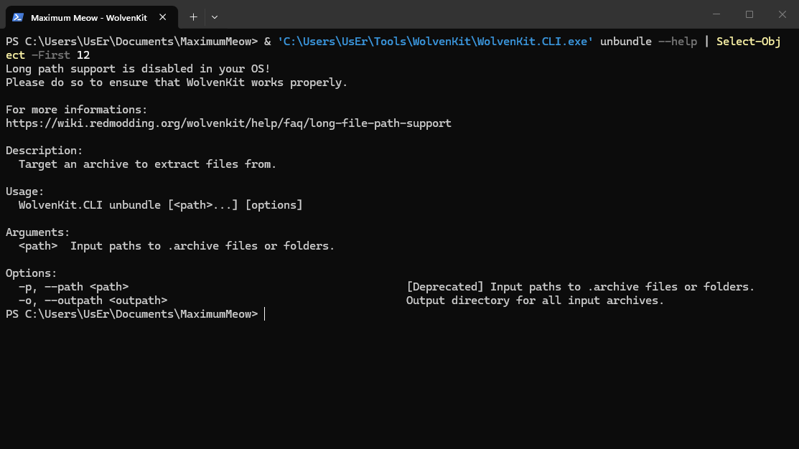

# How I UwU-transformed Cyberpunk 2077's localization

Nope I did not paste onscreen to chat gee pee twee that's like committing linguistic homicide.

I extracted the compiled localization resources using WolvenKit + power of Python to make a text replacer, rebuilt them, then Boom I become cat boy Nyaaa~! No prose was rewritten only replace. The process is deterministic. Same source + same seed = same UwU transformation every time.


## What this process changes

The python script only change visible Eng text stored in localization entries `femaleVariant` and `maleVariant` fields. Menus use readable phonetic mutation, while dialogue and descriptions use lighter transformation rules so they do not become `wwwwww` soup.


## What this process doesn't touch

Audio, Texture, Localized IDs, Resource paths, CP's original archives.


## 1. Get the English localization resources

Cyberpunk does not store its localization as loose editable text files. The English localization resources are compiled CR2W files packed inside REDengine `.archive` containers.

### Locate the game archives

Base game:

```text
<Cyberpunk 2077>\archive\pc\content\lang_en_text.archive
```

Phantom Liberty:

```text
<Cyberpunk 2077>\archive\pc\ep1\lang_en_text.archive
```

### Save the paths as PowerShell variables

I saved the WolvenKit, game, and project paths as PowerShell variables first. It's easier for me to write the extraction commands and prettier to read imo.

```powershell
$WolvenKit = "C:\Users\UsEr\Tools\WolvenKit\WolvenKit.CLI.exe"
$Game = "C:\SteamLibrary\steamapps\common\Cyberpunk 2077"
$Project = "C:\Users\UsEr\Documents\MaximumMeow"
```

These are my paths. Anyone following the guide needs to replace them with your own directory.

### Extract the base-game localization

```powershell
& $WolvenKit unbundle `
  "$Game\archive\pc\content\lang_en_text.archive" `
  -o "$Project\source\base" `
  -v Minimal
```

This will read only:

```text
archive\pc\content\lang_en_text.archive
```

and writes the extracted stuff under:

```text
source\base\
└─ base\
   └─ localization\
      └─ en-us\
```

In my current game version, WolvenKit reported:

```text
lang_en_text.archive: Unbundled 3087/3087 entries.
```

If yours is a wee bit different, it's ok. As long as it's not 40k entries which means that you just have yourself an entire archive.

### Extract the Phantom Liberty localization

```powershell
& $WolvenKit unbundle `
  "$Game\archive\pc\ep1\lang_en_text.archive" `
  -o "$Project\source\ep1" `
  -v Minimal
```

And this writes the expansion stuff under:

```text
source\ep1\
└─ ep1\
   └─ localization\
      └─ en-us\
```

### Understand the extracted files

The extraction retain an identical path of the internal depot paths from each archive.

Base-game resources begin under:

```text
base\localization\en-us\
```

Phantom Liberty resources begin under:

```text
ep1\localization\en-us\
```

For example, this is what an extracted base-game resource look like.:

```text
base\localization\en-us\subtitles\open_world\vendors\wat_kab_stylist_01.json
```

Although the file has `.json` extension, it is not editable nor readable (yet),

### Understand command syntax

In WolvenKit CLI, use `unbundle --help`.



CLI help shown from my PowerShell console; output shortened for readability.

WolvenKit 8.19 defines the syntax as:

```text
WolvenKit.CLI unbundle [<path>...] [options]
```

The arguments used here are:

- `<path>`: the specific `.archive` file to extract
- `-o`, `--outpath`: where WolvenKit writes the extracted resources
- `-v`, `--verbosity`: how much information WolvenKit prints

**Source:** [WolvenKit CLI command list](https://wiki.redmodding.org/wolvenkit/wolvenkit-cli/usage/command-list#unbundle)

> **Note:** My screenshot shows WolvenKit's long-path warning. The extraction still completed, but a short project path or Windows long-path support is recommended.


